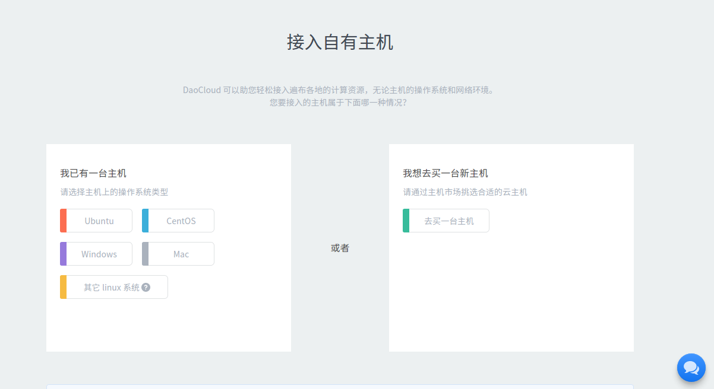
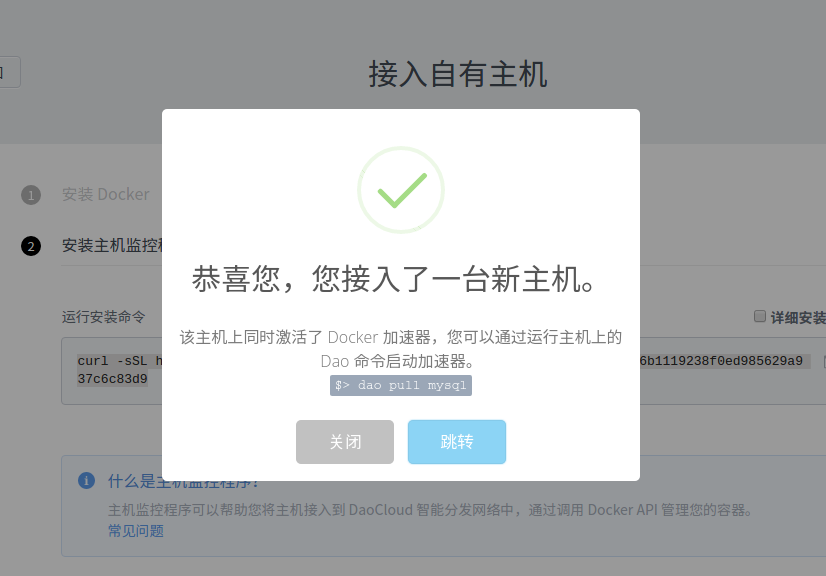
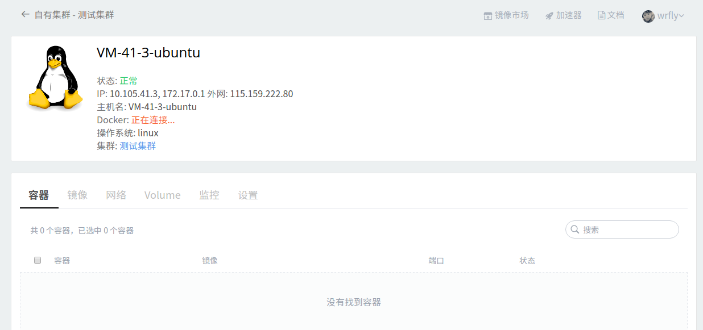
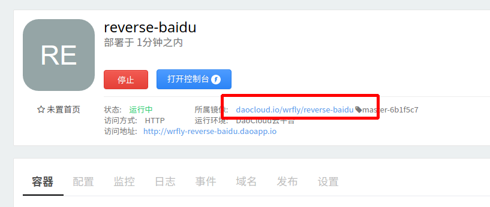
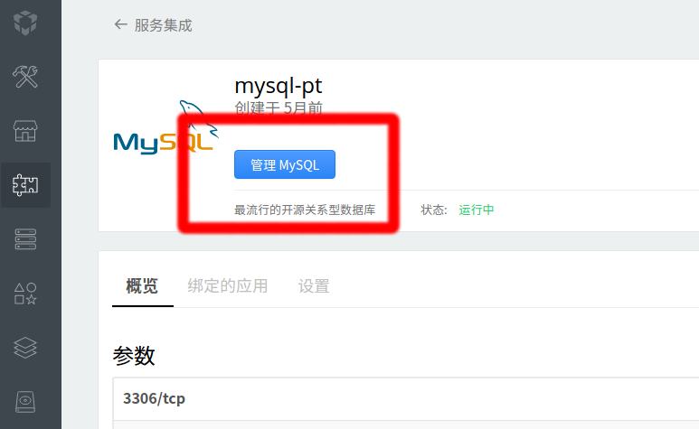
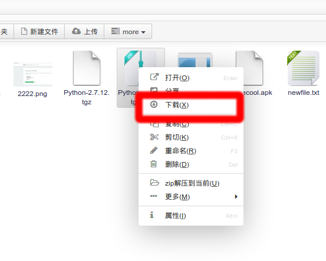
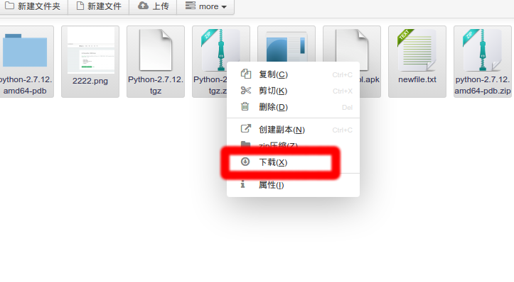

自有主机功能提供将您的主机接入 DaoCloud 的功能。您可以通过 DaoCloud 来统一管理不同平台的大量主机，并无缝享受持续集成、持续发布等服务。

本篇文档演示如何将应用迁移到自有主机。[了解集群和自有主机](http://docs-static.daocloud.io/cluster-mgmt/what-is-cluster#-1)

文档包含以下三个部分，如迁移遇到困难请至 [DaoCloud Services](https://dashboard.daocloud.io) 页面点击右下角联系客服
* [迁移应用到自有主机](http://docs-static.daocloud.io/faq/migrate-from-cloud-limited-env-to-your-own-host#-1)
* [从云端 Mysql 导出数据](http://docs-static.daocloud.io/faq/migrate-from-cloud-limited-env-to-your-own-host#mysql)
* [从云端 Volume 导出数据](http://docs-static.daocloud.io/faq/migrate-from-cloud-limited-env-to-your-own-host#volume)
* [从云端 Postgres 导出数据](http://docs-static.daocloud.io/faq/migrate-from-cloud-limited-env-to-your-own-host#postgres)
 
##### 准备您的自有主机
请先准备一台用于生产环境的主机
请根据以下步骤接入主机到 DaoCloud：

### 迁移应用到自有主机

准备一台可以连接互联网的装有Linux系统的主机，然后进行添加主机动作。

如果主机没有安装Docker，则需要在命令行里复制以下代码：

然后安装Monit程序：

安装完成后，接入成功：

点击跳转，进入主机页面：

连接成功后：

### 迁移应用

查看您的应用列表：

选择您需要迁移的应用，点击所属镜像：

然后点击右上角的部署：

创建应用的时候选择我的主机：

配置好基础设置：

运行成功：

##### 导出云端 Mysql 的数据：
在服务集成页面，选择“我的服务”，并选择一个数据库：

点击“管理Mysql”：

然后选择导出数据库：

点击执行，即可将sql文件导出到本地：

##### 导出云端 Volume 的数据：

打开Volume页面：

选择要备份的Volume：

点击管理Volume：

然后选择您需要备份的文件：

在文件上右键，下载文件：

或者多项选择文件，右键下载：

##### 导出云端 Postgres 的数据

首先在Volume页面创建一个Volume，用于保存导出的数据：

在镜像仓库里搜索 “pg_dumpall”:

点击部署:

配置基本信息:

绑定要导出的pg数据库：

绑定Volume，容器路径为 /data：

查看应用的日志，如果出现提示导出成功的日志，则表明导出数据库成功：

打开Volume管理器：

即可看到已经导出的sql文件，右键可以直接下载到本地：

