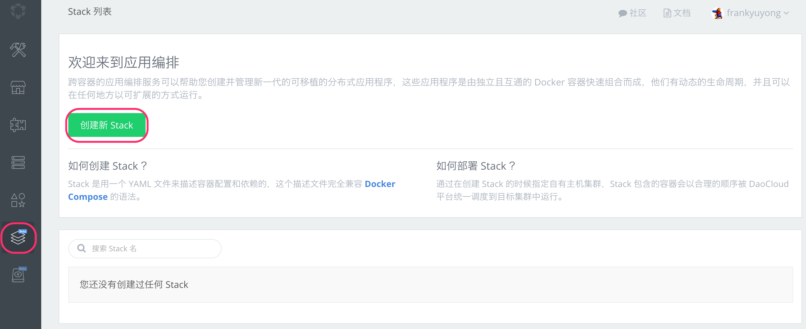
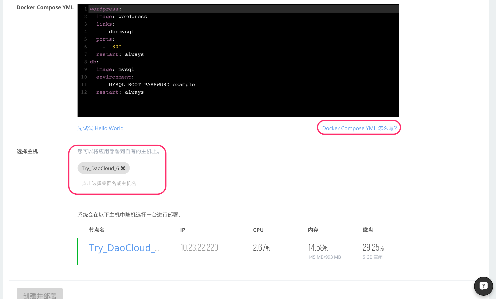

跨容器的应用编排服务可以帮助您创建并管理新一代的可移植的分布式应用程序，这些应用程序是由独立且互通的 Docker 容器快速组合而成，他们有动态的生命周期，并且可以在任何地方以可扩展的方式运行。Stack 是用一个 YAML 文件来描述容器配置和依赖的，这个描述文件完全兼容 Docker Compose 的语法。通过在创建 Stack 的时候指定自有主机集群，Stack 包含的容器会以合理的顺序被 DaoCloud 平台统一调度到目标集群中运行。



点击「创建新 Stack」后，用户可以根据 Docker Compose 语法，输入复杂应用的编排指令。目前 Stack 编排的应用只能部署在自有主机之上。建议您仔细阅读下文的 Docker Compose 语法。



## Docker Compose YML

DaoCloud 应用可以提供 Docker Compose YML的支持(目前仅限自有主机的应用)，完全兼容[Docker Compose V2](https://docs.docker.com/compose/compose-file/)，并有一些扩展的功能。您在界面里对应用做的更改都会提醒在这个YML里面。

Docker Compose YML是由若干Service组成，每个Service都必须包括Image。其他的字段都是可选的，功能和docker run命令保持一致。

### image

镜像的地址，可以在镜像仓库找到。DaoCloud会在主机不存在该镜像的时候，拉取。

```
	image: ubuntu
	image: orchardup/postgresql
	image: a4bc65fd
```
### command

覆盖掉默认的命令

```
	command: bundle exec thin -p 3000
```
### links

可以Link到其他的容器。可以直接写应用名(同一个YML内)，或者可以写Link别名(SERVICE:ALIAS)

```
	links:
	 - db
	 - db:database
	 - redis
```	 

Docker Link 会修改您容器内的HOST表和环境变量，的工作方式可以参考 [Docker Link文档](https://docs.docker.com/userguide/dockerlinks/)

### external_links

可以Link到不是同一个YML内的容器。语法和普通的Link接近。但启动的时候要保证被Link的容器是正常运行的。可以直接写应用名(同一个YML内)，或者可以写Link别名(SERVICE:ALIAS)

```
	external_links:
	 - redis_1
	 - project_db_1:mysql
	 - project_db_1:postgresql
```

### extra_hosts

hostname映射。相当于在Docker Run中--add-host 参数.

```
	extra_hosts:
	 - "somehost:162.242.195.82"
	 - "otherhost:50.31.209.229"
```

这个配置会在容器的 /etc/hosts 文件中添加如下的内容。

```
	162.242.195.82  somehost
	50.31.209.229   otherhost
```

### ports

开放端口，可以同时申明主机和容器端口 (HOST:CONTAINER), 也可以只申明容器端口。(会随机选定一个外部端口).

```
	ports:
	 - "3000"
	 - "8000:8000"
	 - "49100:22"
	 - "127.0.0.1:8001:8001"
```

### expose

开放端口但不会在主机上映射。仅仅用于被其他的容器Link。只能保留内部端口

```
	 expose:
	 - "3000"
	 - "8000"
```

### volumes

支持Mount存储卷，可以支持指定主机路径和容器路径(HOST:CONTAINER), 还可以包括只读 (HOST:CONTAINER:ro).

```
	volumes:
	 - /var/lib/mysql
	 - ./cache:/tmp/cache
	 - ~/configs:/etc/configs/:ro
```	 

### volumes_from

支持从其他APP和容器Mount。

```
	volumes_from:
	 - service_name
	 - container_name
```

### environment

可以添加环境变量，您可以指定YML数组或者字典。

```
	environment:
	  RACK_ENV: development
	  SESSION_SECRET:

	environment:
	  - RACK_ENV=development
	  - SESSION_SECRET
```

### labels

可以通过Docker Lable给容器加一些元数据。

```
	labels:
	  com.example.description: "Accounting webapp"
	  com.example.department: "Finance"
	  com.example.label-with-empty-value: ""

	labels:
	  - "com.example.description=Accounting webapp"
	  - "com.example.department=Finance"
	  - "com.example.label-with-empty-value"
```

### log driver

可以给容器增加Log Driver。和命令行参数 --log-driver 相同

现在支持 json-file, syslog and none. 默认是 json-file.

```
	log_driver: "json-file"
	log_driver: "syslog"
	log_driver: "none"
```

### net

网络模式. 和命令行参数 --net 相同

```
	net: "bridge"
	net: "none"
	net: "container:[name or id]"
	net: "host"
```

### pid

```
    pid: "host"
	
```

### dns

自定义DNS服务器。

```
	dns: 8.8.8.8
	dns:
	  - 8.8.8.8
	  - 9.9.9.9
```

### cap_add, cap_drop

增加或者删除容器的能力

```
	cap_add:
	  - ALL

	cap_drop:
	  - NET_ADMIN
	  - SYS_ADMIN
```

### dns_search

自定义DNS搜索域名。

```
	dns_search: example.com
	dns_search:
	  - dc1.example.com
	  - dc2.example.com
```

### devices

设备映射. 和命令行参数 --device 相同

```
	devices:
	  - "/dev/ttyUSB0:/dev/ttyUSB0"
```

### security_opt

覆盖默认的容器安全参数

```
	security_opt:
	  - label:user:USER
	  - label:role:ROLE
```

### working_dir, entrypoint, user, hostname, domainname,  mem_limit, privileged, restart, stdin_open, tty, cpu_shares, cpuset, read_only

下列的熟悉都和 docker run 命令中的参数相同。

```
	cpu_shares: 73
	cpuset: 0,1

	working_dir: /code
	entrypoint: /code/entrypoint.sh
	user: postgresql

	hostname: foo
	domainname: foo.com

	mac_address: 02:42:ac:11:65:43

	mem_limit: 1000000000
	privileged: true

	restart: always

	stdin_open: true
	tty: true
	read_only: true
```


### DaoCloud 不支持的功能

Docker Compose运行在本地，而DaoCloud运行在云端。有少量的参数是暂时不支持的。

因此DaoCloud暂时不支持和构建相关的参数。也不支持和本地配置文件有关的参数。包括

* build
* env_file 
* dockerfile
* extends